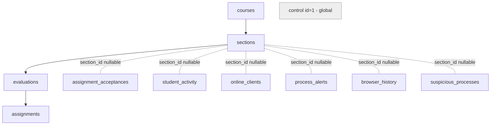

# Diseño Técnico: Multi-evaluación (Curso > Sección > Evaluación)

**Change:** multi-evaluation
**Base:** forward-compatible sobre `section TEXT` + trigger sincronizador (patrón `migration-blocklist.sql`).

---

## 1. Arquitectura general

Jerarquía nueva: `courses → sections → evaluations → assignments`. `assignments` hereda curso y sección vía `evaluation_id` (una sola fuente de verdad). `control` (id=1) se mantiene **intocado** y global.



**Tablas nuevas**: `courses`, `sections`, `evaluations`.
**Tablas modificadas**: `assignments` (add `evaluation_id`), 6 tablas con `section_id` nullable + trigger.
**Tablas intocadas**: `control`, `targeted_lockdowns`, `cheat_events`.

---

## 2. Modelo de datos SQL

Esquema completo idempotente. Se ejecuta en SQL Editor de Supabase (`oiownlxyquarmqwauegf`). Archivo nuevo: `csharp/migration-multi-evaluation.sql`.

### 2.1 Tablas nuevas

```sql
CREATE TABLE IF NOT EXISTS courses (
  id BIGSERIAL PRIMARY KEY,
  code TEXT UNIQUE NOT NULL,
  name TEXT NOT NULL,
  active BOOL DEFAULT true,
  created_at TIMESTAMPTZ DEFAULT now()
);
ALTER TABLE courses ENABLE ROW LEVEL SECURITY;
DROP POLICY IF EXISTS anon_read_courses ON courses;
CREATE POLICY anon_read_courses ON courses FOR SELECT TO anon, authenticated USING (true);
DROP POLICY IF EXISTS auth_all_courses ON courses;
CREATE POLICY auth_all_courses ON courses FOR ALL TO authenticated USING (true) WITH CHECK (true);

CREATE TABLE IF NOT EXISTS sections (
  id BIGSERIAL PRIMARY KEY,
  course_id BIGINT NOT NULL REFERENCES courses(id) ON DELETE CASCADE,
  code TEXT NOT NULL,
  name TEXT NOT NULL,
  created_at TIMESTAMPTZ DEFAULT now(),
  UNIQUE (course_id, code)
);
ALTER TABLE sections ENABLE ROW LEVEL SECURITY;
DROP POLICY IF EXISTS anon_read_sections ON sections;
CREATE POLICY anon_read_sections ON sections FOR SELECT TO anon, authenticated USING (true);
DROP POLICY IF EXISTS auth_all_sections ON sections;
CREATE POLICY auth_all_sections ON sections FOR ALL TO authenticated USING (true) WITH CHECK (true);

CREATE TABLE IF NOT EXISTS evaluations (
  id BIGSERIAL PRIMARY KEY,
  section_id BIGINT NOT NULL REFERENCES sections(id) ON DELETE CASCADE,
  title TEXT NOT NULL,
  classroom_url TEXT,
  org TEXT,
  active BOOL DEFAULT false,
  created_at TIMESTAMPTZ DEFAULT now(),
  UNIQUE(section_id, title)
);
ALTER TABLE evaluations ENABLE ROW LEVEL SECURITY;
DROP POLICY IF EXISTS anon_read_evaluations ON evaluations;
CREATE POLICY anon_read_evaluations ON evaluations FOR SELECT TO anon, authenticated USING (active = true);
DROP POLICY IF EXISTS auth_all_evaluations ON evaluations;
CREATE POLICY auth_all_evaluations ON evaluations FOR ALL TO authenticated USING (true) WITH CHECK (true);
```

### 2.2 ALTER de `assignments`

```sql
ALTER TABLE assignments ADD COLUMN IF NOT EXISTS evaluation_id BIGINT NULL REFERENCES evaluations(id) ON DELETE SET NULL;
```

### 2.3 ALTER de las 6 tablas con section_id + trigger

```sql
ALTER TABLE assignment_acceptances ADD COLUMN IF NOT EXISTS section_id BIGINT NULL REFERENCES sections(id) ON DELETE SET NULL;
ALTER TABLE student_activity        ADD COLUMN IF NOT EXISTS section_id BIGINT NULL REFERENCES sections(id) ON DELETE SET NULL;
ALTER TABLE online_clients          ADD COLUMN IF NOT EXISTS section_id BIGINT NULL REFERENCES sections(id) ON DELETE SET NULL;
ALTER TABLE process_alerts          ADD COLUMN IF NOT EXISTS section_id BIGINT NULL REFERENCES sections(id) ON DELETE SET NULL;
ALTER TABLE browser_history         ADD COLUMN IF NOT EXISTS section_id BIGINT NULL REFERENCES sections(id) ON DELETE SET NULL;
ALTER TABLE suspicious_processes    ADD COLUMN IF NOT EXISTS section_id BIGINT NULL REFERENCES sections(id) ON DELETE SET NULL;
```

Trigger sincronizador (una función compartida + un trigger por tabla):

```sql
CREATE OR REPLACE FUNCTION sync_section_id() RETURNS TRIGGER AS $$
DECLARE v_id BIGINT;
BEGIN
  IF NEW.section IS DISTINCT FROM OLD.section OR NEW.section_id IS NULL THEN
    SELECT id INTO v_id FROM sections WHERE code = NEW.section LIMIT 1;
    NEW.section_id := v_id;
  END IF;
  RETURN NEW;
END; $$ LANGUAGE plpgsql;

CREATE OR REPLACE TRIGGER trg_sync_section_acceptances  BEFORE INSERT OR UPDATE ON assignment_acceptances FOR EACH ROW EXECUTE FUNCTION sync_section_id();
-- ...idem para student_activity, online_clients, process_alerts, browser_history, suspicious_processes
```

### 2.4 Backfill idempotente

```sql
INSERT INTO courses (code, name) VALUES ('FPY1101', 'Física I') ON CONFLICT (code) DO NOTHING;
INSERT INTO sections (course_id, code, name)
  SELECT c.id, s.code, s.code FROM courses c, (VALUES ('001D'),('002D'),('003D')) AS s(code)
  WHERE c.code='FPY1101' ON CONFLICT (course_id, code) DO NOTHING;
-- 5 evaluaciones por seccion (Evaluacion-1..4, Examen) tomadas de Config.EvaluationTypes.
-- Scopeado al curso FPY1101 via course_id; active=false hasta que el profe active.
INSERT INTO evaluations (section_id, title, active)
  SELECT s.id, e.title, false FROM sections s, (VALUES ('Evaluación 1'),('Evaluación 2'),('Evaluación 3'),('Evaluación 4'),('Examen')) AS e(title)
  WHERE s.course_id = (SELECT id FROM courses WHERE code='FPY1101')
    AND s.code IN ('001D','002D','003D')
  ON CONFLICT (section_id, title) DO NOTHING;
```

---

## 3. Cambios en C# (`csharp/src/`)

| Archivo | Cambio |
|--------|--------|
| `Models/Dtos.cs` | Nuevos DTOs `Course`, `SectionRow`, `Evaluation` con `[JsonPropertyName("snake_case")]`. Extender `Assignment` con `EvaluationId`. Extender `Acceptance` con `EvaluationId`. |
| `Services/SupabaseClient.cs` | Nuevos: `GetCoursesAsync()`, `GetSectionsAsync(courseId)`, `GetEvaluationsAsync(sectionId, onlyActive=true)`. Ajustar `GetActiveAssignmentsAsync` para filtrar por `evaluation_id`. Ajustar `RecordAcceptanceAsync` (nuevo param `evaluation_id`). Ajustar `SendHeartbeatAsync`, `ReportProcessAlertAsync`, `ReportStudentActivityAsync`, `ReportBrowsingAsync` para enviar `section_id`. Ajustar `GetBlocklistAsync` (coalesce `section_id`/`section`). |
| `Services/StudentSection.cs` | Persistir `SectionId` + `EvaluationId` además de `Section` (TEXT) en HKCU. |
| `Config.cs` | `Sections` y `EvaluationTypes` pasan a **fallback** con comentario doc (patrón `SuspiciousProcesses`). |
| `Windows/MainWindow.xaml` | Agregar combos `CursoCombo` + `EvaluationCombo` (cascada). Reubicar `TipoCombo` como solo-lectura (muestra `evaluation.title`). |
| `Windows/MainWindow.xaml.cs` | Cascada Curso→Sección→Evaluación en `InitAsync`, `SectionCombo_SelectionChanged`, nuevo `EvaluationCombo_SelectionChanged`. Ajustar `FilterBySection`, `ComputeAssignmentStatusesAsync`, `UpdateAssignmentsBanner`, `ShowAssignmentsDialog`. `SubirArchivosAsync`: eliminar `switch` `tipoLabel` hardcoded, usar `Evaluation.Title`. Ajustar `GetRepoName`. |
| `Windows/SectionPromptWindow.xaml(.cs)` | Extender a selección Curso + Sección + Evaluación (o diálogo nuevo `OnboardingWindow`). |

**Fallback de red**: null=fallo → usar `Config.Sections`/`EvaluationTypes`; `[]`=BD vacía. Mismo patrón que `GetBlocklistAsync`.

---

## 4. Cambios en admin-next

| Archivo | Cambio |
|--------|--------|
| `lib/types.ts` | Agregar `CourseRow`, `SectionRow`, `EvaluationRow`. Extender `AssignmentRow` (`evaluation_id`), `AssignmentAcceptanceRow`, `OnlineClientRow`, `ProcessAlertRow`, `BrowserHistoryRow`, `StudentActivityRow`, `SuspiciousProcess` con `section_id`. |
| `components/sections/CoursesSection.tsx` | **Nuevo**: CRUD de cursos (code, name, active). |
| `components/sections/EvaluationsSection.tsx` | **Nuevo**: CRUD de evaluaciones por sección + toggle `active`. |
| `components/sections/AssignmentsSection.tsx` | Reemplazar `asgSection` hardcoded por fetch dinámico. Agregar selects Curso/Evaluación al alta. CRUD con `evaluation_id`. |
| `components/sections/SuspiciousProcessesSection.tsx` | Reemplazar `const SECTIONS = ["001D","002D","003D"]` por fetch dinámico. |
| `components/sections/ActivitySection.tsx` | Ajustar filtro `sectionFilter` a fetch dinámico + columna `section_id` con lookup. |
| `components/sections/OnlineClientsSection.tsx` | Ajustar badges/columna de sección a `section_id` + lookup. |
| `components/sections/BrowsingSection.tsx` | Columna "Sección" → `section_id` + lookup. |
| `components/sections/ProcessAlertsSection.tsx` | Columna "Sección" → `section_id` + lookup. |
| `components/Sidebar.tsx` | Agregar nav items `Cursos` / `Evaluaciones`. |
| `components/sections/Panel.tsx` | Agregar `CoursesSection` + `EvaluationsSection` al layout. |
| `hooks/useCourses.ts`, `useEvaluations.ts` | **Nuevos**: hooks CRUD. |

---

## 5. Archivos a borrar

| Archivo | Razón |
|--------|-------|
| `admin/index.html` | Reemplazado por `admin-next/`. Duplica hardcodeos de sección. |
| `Subir-Evaluacion.ps1` | Cliente PowerShell deprecado; duplica `Config.Sections` + `switch` `Evaluacion-1..4`. |
| `Subir-Evaluacion.bat` | Lanzador del `.ps1`. |
| `Subir-Evaluacion-DEBUG.bat` | Lanzador debug del `.ps1`. |
| `Reset-GitHubAuth.ps1` | Helper legacy del `.ps1`. |
| `Reset-Internet.bat` | Helper legacy del `.ps1`. |

---

## 6. Secuenciación de implementación

Cada fase deja el sistema funcional y deployable.

1. **Migraciones SQL** (`csharp/migration-multi-evaluation.sql` + edición de `csharp/migration-acceptances.sql` para RPC `record_acceptance`): tablas nuevas + alters + triggers + backfill. Idempotente.
2. **admin-next types + CRUD Cursos/Evaluaciones**: `lib/types.ts`, `CoursesSection.tsx`, `EvaluationsSection.tsx`, hooks, `Sidebar.tsx`, `Panel.tsx`.
3. **admin-next selects dinámicos** en `AssignmentsSection`, `SuspiciousProcessesSection`, `ActivitySection`, `OnlineClientsSection`, `BrowsingSection`, `ProcessAlertsSection`.
4. **C# DTOs + SupabaseClient**: `Models/Dtos.cs`, `Services/SupabaseClient.cs`.
5. **C# UI cascada + StudentSection**: `MainWindow.xaml(.cs)`, `SectionPromptWindow.xaml(.cs)`, `Config.cs` fallback.
6. **Borrado de legacy**: 6 archivos listados en §5.
7. **Docs**: `README.md`, `docs/Guia-Alumno.tex`, `admin-next/README.md`.

---

## 7. Decisiones de diseño

| Decisión | Elección | Razón |
|----------|----------|-------|
| `section_id` nullable + trigger vs migración directa | Nullable + trigger sincronizador | Forward-compat con clientes v2.5.x que reportan vía `section TEXT`. Mismo patrón de `migration-blocklist.sql`. |
| `evaluations.section_id` (no `course_id`) | `section_id` FK | Jerarquía elegida por el usuario: Curso > Sección > Evaluación. La evaluación pertenece a una sección, no a un curso. |
| Herencia de curso/sección en `assignments` vía `evaluation_id` | Una sola fuente de verdad (la evaluación) | Evita inconsistencias: no se setea `section`/`course_id` directo en `assignments`. |
| Borrar legacy vs actualizar | Borrar | El cliente C# es el oficial; mantener duplicados del `.ps1`/`admin/index.html` duplica el trabajo de multi-evaluación. |
| `control` global vs por evaluación | Global (intocado) | Fuera de alcance del change (spec REQ-10). El `force_lockdown`/`message` afecta a todos los conectados. |
| Realtime para `evaluations`/`assignments` | Excluido | Fuera de alcance (proposal §2 Excluido). El panel recarga a mano como hoy. |
| Backfill desde `Config.cs` | Insert idempotente `ON CONFLICT DO NOTHING` | Curso default `FPY1101` + 3 secciones + 5 evaluaciones activas por sección. Re-corrible. |

---

## 8. Estrategia de testing

| Capa | Qué | Cómo |
|------|-----|------|
| SQL | Idempotencia, RLS, trigger | Re-correr migración 2× en dev branch; verificar `section_id` se llena tras INSERT con `section='001D'`. |
| C# | Fallback, cascada | Arrancar cliente con BD caída → combos se llenan desde `Config.cs`. Arrancar con BD up → combos fetcheados. |
| admin-next | CRUD Cursos/Evaluaciones, selects dinámicos | `pnpm build && pnpm lint`. Crear curso+sección+evaluación desde UI y verificar en `assignments` el hereda via `evaluation_id`. |
| E2E | Criterios de éxito del proposal | Profe crea evaluación sin tocar código; alumno ve solo activas de su sección; v2.5.x sigue reportando. |

---

## 9. Migración / Rollout

- **Migración**: no destructiva (`CREATE TABLE IF NOT EXISTS`, `ADD COLUMN IF NOT EXISTS`, `DROP POLICY IF EXISTS` antes de `CREATE POLICY`, `ON CONFLICT DO NOTHING`). Re-corrible.
- **Coexistencia**: clientes v2.5.x siguen insertando vía `section TEXT`; el trigger completa `section_id`. Cero regresión.
- **Rollback**: `DROP TABLE IF EXISTS evaluations, sections, courses CASCADE` + `git checkout` de archivos borrados + `DROP COLUMN section_id, evaluation_id` (opcional). Clientes viejos siguen funcionando contra `section TEXT`.
- **Distribución**: release Velopack v2.6.x con cliente actualizado. Hasta que todos los clientes migren, el trigger mantiene consistencia.
